# Data Engineering

## HomeWork

### Week 1

#### Question 1.

```bash
pip --version
```
```bash
pip 24.3.1 from /Users/savioabuga/Projects/data-engineering-zoomcamp/.venv/lib/python3.12/site-packages/pip (python 3.12)
```

#### Question 3. Trip Segmentation Count

```sql
SELECT
 COUNT(1)
FROM
 GREEN_TAXI_DATA
WHERE
 LPEP_PICKUP_DATETIME >= '2019-10-01'
 AND LPEP_DROPOFF_DATETIME < '2019-11-01'
 AND TRIP_DISTANCE <= 1;

SELECT
 COUNT(1)
FROM
 GREEN_TAXI_DATA
WHERE
 LPEP_PICKUP_DATETIME >= '2019-10-01'
 AND LPEP_DROPOFF_DATETIME < '2019-11-01'
 AND TRIP_DISTANCE > 1
 AND TRIP_DISTANCE <= 3;

SELECT
 COUNT(1)
FROM
 GREEN_TAXI_DATA
WHERE
 LPEP_PICKUP_DATETIME >= '2019-10-01'
 AND LPEP_DROPOFF_DATETIME < '2019-11-01'
 AND TRIP_DISTANCE > 3
 AND TRIP_DISTANCE <= 7;

SELECT
  COUNT(1)
FROM
 GREEN_TAXI_DATA
WHERE
 LPEP_PICKUP_DATETIME >= '2019-10-01'
 AND LPEP_DROPOFF_DATETIME < '2019-11-01'
 AND TRIP_DISTANCE > 7
 AND TRIP_DISTANCE <= 10;

SELECT
 COUNT(1)
FROM
 GREEN_TAXI_DATA
WHERE
 LPEP_PICKUP_DATETIME >= '2019-10-01'
 AND LPEP_DROPOFF_DATETIME < '2019-11-01'
 AND TRIP_DISTANCE > 10;
```

#### Question 4. Longest trip for each day

```sql
SELECT
 CAST(LPEP_PICKUP_DATETIME AS DATE)
FROM
 GREEN_TAXI_DATA
ORDER BY trip_distance DESC LIMIT 1;
```

#### Question 5. Three biggest pickup zones

```sql
SELECT
 ZPU."Zone" AS "PICKUP_LOCATION",
 SUM(TOTAL_AMOUNT) AS "TRIP_TOTAL_AMOUNT"
FROM
 GREEN_TAXI_DATA T
 INNER JOIN ZONES ZPU ON ZPU."LocationID" = T."PULocationID"
WHERE
 LPEP_PICKUP_DATETIME >= '2019-10-18'
 AND LPEP_PICKUP_DATETIME < '2019-10-19'
GROUP BY
 1
HAVING
 SUM(TOTAL_AMOUNT) > 13000
ORDER BY
 1 DESC;
```

#### Question 6. Largest tip

```sql
SELECT
 ZDO."Zone" AS DROP_OFF_ZONE,
 TIP_AMOUNT
FROM
 GREEN_TAXI_DATA T
 INNER JOIN ZONES ZPU ON ZPU."LocationID" = T."PULocationID"
 INNER JOIN ZONES ZDO ON ZDO."LocationID" = T."DOLocationID"
WHERE
 LPEP_PICKUP_DATETIME BETWEEN '2019-10-01' AND '2019-10-31'
 AND ZPU."Zone" = 'East Harlem North'
ORDER BY
 TIP_AMOUNT DESC
LIMIT
 1;
```

### Question 7. Terraform Workflow

```bash
terraform init
terraform apply -auto-approve
terraform destroy
```

### Week 2

#### q3

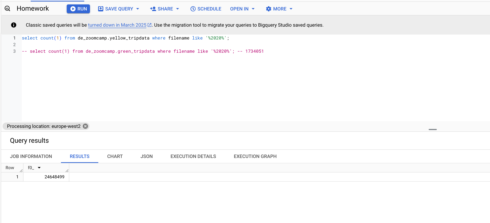

#### q4

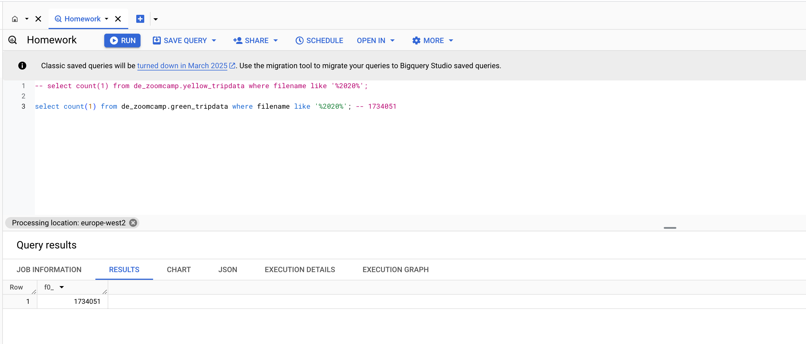

#### q5

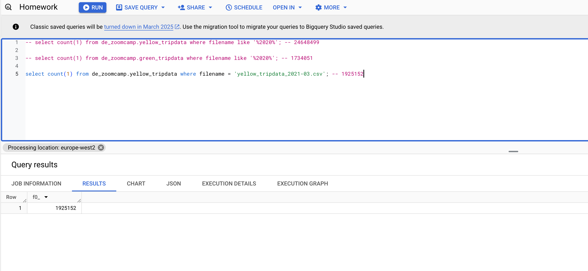

#### q6

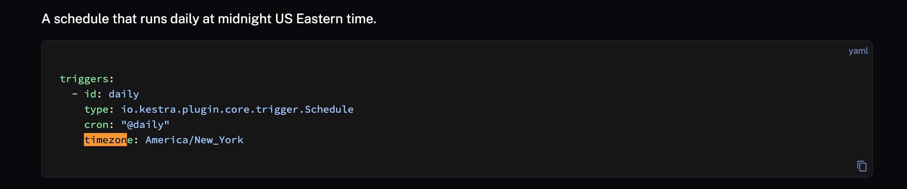

### Week 3

#### Question 1

```sql
select count(1) from `dezoomcamp_hw3.external_yellow_tripdata`;
```

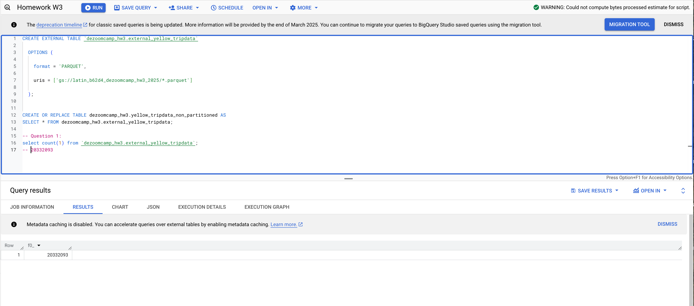

#### Question 2

```sql
select count(distinct(PULocationID)) from `dezoomcamp_hw3.external_yellow_tripdata`;
select count(distinct(PULocationID)) from `dezoomcamp_hw3.yellow_tripdata_non_partitioned`; -- 155.2 MBs
```

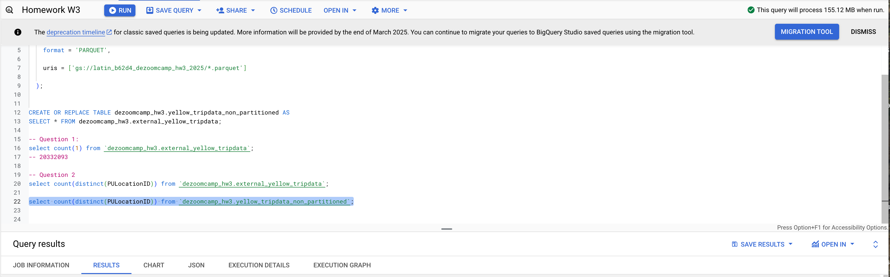

#### Question 3

```sql
select PULocationID,  from `dezoomcamp_hw3.yellow_tripdata_non_partitioned`;
select PULocationID, DOLocationID from `dezoomcamp_hw3.yellow_tripdata_non_partitioned`;
```

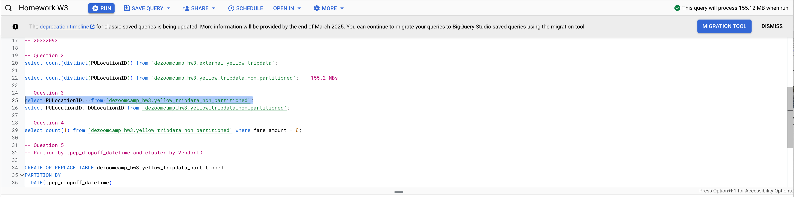
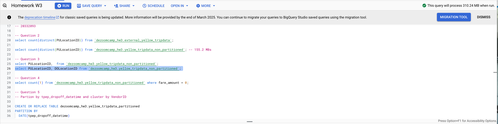

#### Question 4

```sql
select count(1) from `dezoomcamp_hw3.yellow_tripdata_non_partitioned` where fare_amount = 0;
```

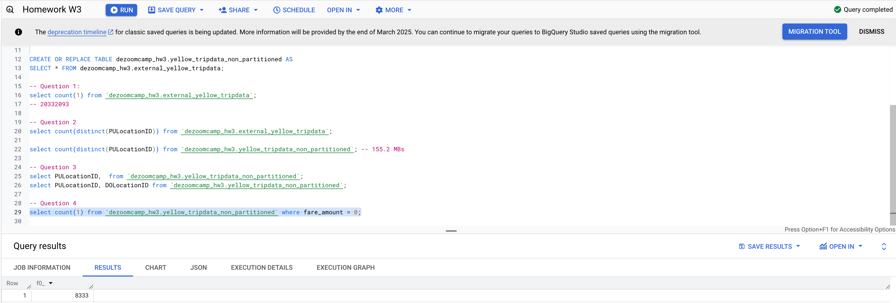

#### Question 5

```sql
CREATE OR REPLACE TABLE dezoomcamp_hw3.yellow_tripdata_partitioned
PARTITION BY
  DATE(tpep_dropoff_datetime) 
CLUSTER BY VendorID AS
SELECT * FROM dezoomcamp_hw3.external_yellow_tripdata;
```

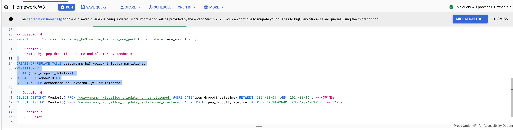

#### Question 6

```sql
SELECT DISTINCT(VendorId) FROM `dezoomcamp_hw3.yellow_tripdata_non_partitioned` WHERE DATE(tpep_dropoff_datetime) BETWEEN '2024-03-01' AND '2024-03-15'; -- ~301MBs
SELECT DISTINCT(VendorId) FROM `dezoomcamp_hw3.yellow_tripdata_partitioned_clustered` WHERE DATE(tpep_dropoff_datetime) BETWEEN '2024-03-01' AND '2024-03-15'; -- 26MBs
```

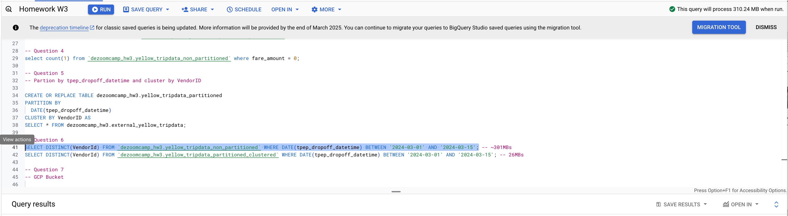

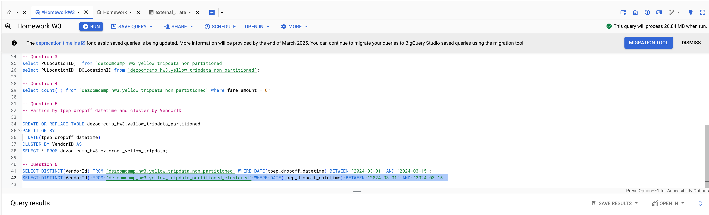

### DLT Workshop

#### DLT Question 1

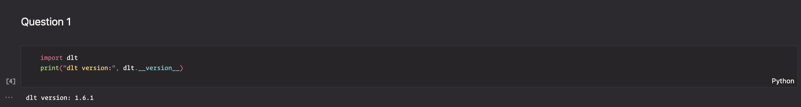

#### DLT Question 2

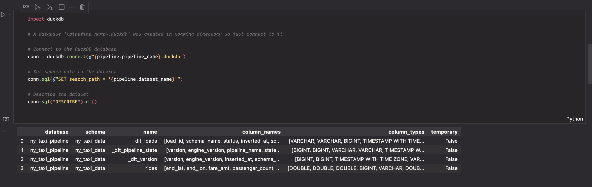

#### DLT Question 3

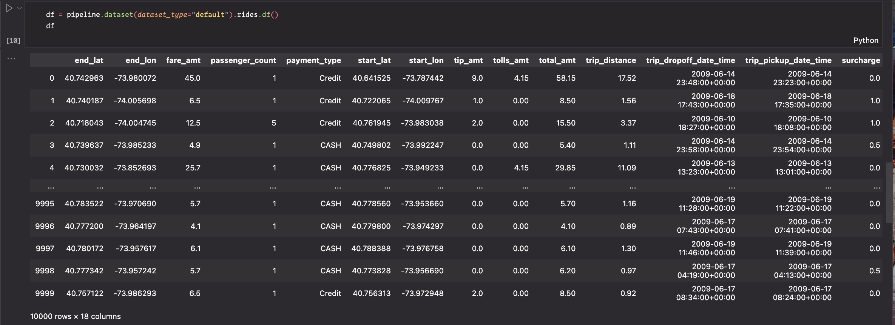

#### DLT Question 4


